# Spigot 是什么？

Spigot 是一个基于 Minecraft 的开源服务器软件，旨在优化性能和扩展功能。它支持 Bukkit 插件并且还提供了 Spigot API ，对插件提供多线程处理和高效的资源管理，兼容多个 Minecraft 版本。Spigot 具有易于配置的管理工具和活跃的社区支持，适合个人玩家和大型服务器管理员，确保游戏的安全性和公平性。

## Spigot 和她的孩子们

```mermaid
graph TD;
    subgraph Bukkit
        A[Vanilla]
    end
    subgraph Spigot
        B[基于Bukkit]
    end
    subgraph Paper
        C[基于Spigot]
        D[Pufferfish]
        D-->C
        E[Tuinity]
        E-->C
        F[Magma]
        F-->C
        G[Kaiiju]
        G-->C
        H[Arclight]
        H-->B
        I[EmpireCraft]
        I-->C
        J[Slice]
        J-->C
        K[Polpot]
        K-->C
        L[KTP]
        L-->C
        M[PandaSpigot]
        M-->C
        N[SparklyPaper]
        N-->C
        O[Luminol]
        O-->C
        P[Folia]
        P-->C
    end
    subgraph Pufferfish
        Q[基于Spigot]
    end
    subgraph Purpur
        R[混合了Pufferfish补丁的Paper分支]
        R-->C
        S[Mirai]
        S-->R
    end
    subgraph Arclight
        T[基于Spigot]
    end
    subgraph MultiPaper
        U[基于Purpur]
        U-->R
    end
    subgraph Airplane
        V[基于Paper]
        V-->C
    end
    subgraph Mirai
        W[基于Pufferfish]
        W-->R
    end
    subgraph Tuinity
        X[基于Paper]
        X-->C
    end
    subgraph Pufferfish
        Y[基于Spigot]
    end
    subgraph Folia
        Z[基于Paper]
        Z-->C
    end
    subgraph Kaiiju
        AA[基于Folia]
        AA-->Z
    end
    subgraph PlazmaBukkit
        BB[基于Paper]
        BB-->C
    end
    subgraph JettPack
        CC[基于Pufferfish]
        CC-->I
    end
    subgraph Polpot
        DD[基于Purpur]
        DD-->K
    end
    subgraph KTP
        EE[基于Paper]
        EE-->L
    end
    subgraph PandaSpigot
        FF[基于Paper]
        FF-->M
    end
    subgraph SparklyPaper
        GG[基于Paper]
        GG-->N
    end
    subgraph Luminol
        HH[基于Folia]
        HH-->O
    end
    subgraph Gale
        II[基于Paper]
        II-->P
    end
    subgraph Leaf
        JJ[基于Gale]
        JJ-->II
    end
    subgraph GALE
        KK[整合了Airplane、Purpur、Mirai、Kaiiju、Plazma、KeYi、EmpireCraft、Slice、JettPack、Lithium等分支的补丁]
        KK-->II
    end
```

