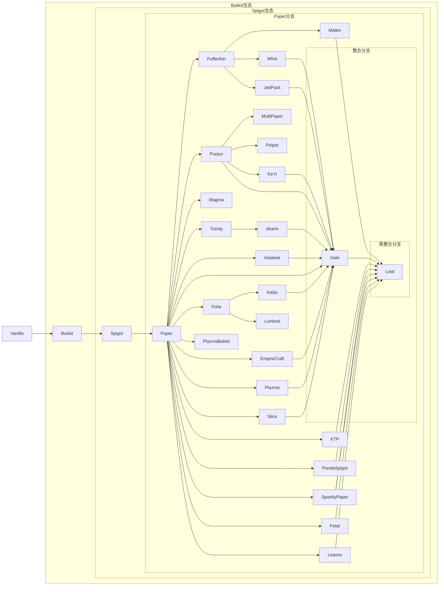

# Spigot 是什么？

Spigot 是一个基于 Minecraft 的开源服务器软件，旨在优化性能和扩展功能。它支持 Bukkit 插件并且还提供了 Spigot API ，对插件提供多线程处理和高效的资源管理，兼容多个 Minecraft 版本。Spigot 具有易于配置的管理工具和活跃的社区支持，适合个人玩家和大型服务器管理员，确保游戏的安全性和公平性。

## 庞大的 Spigot 家族

::: details Spigot和她的孩子们（不完全）

:::

由于很多服务端是分支，所以有很多配置文件是通用的。
